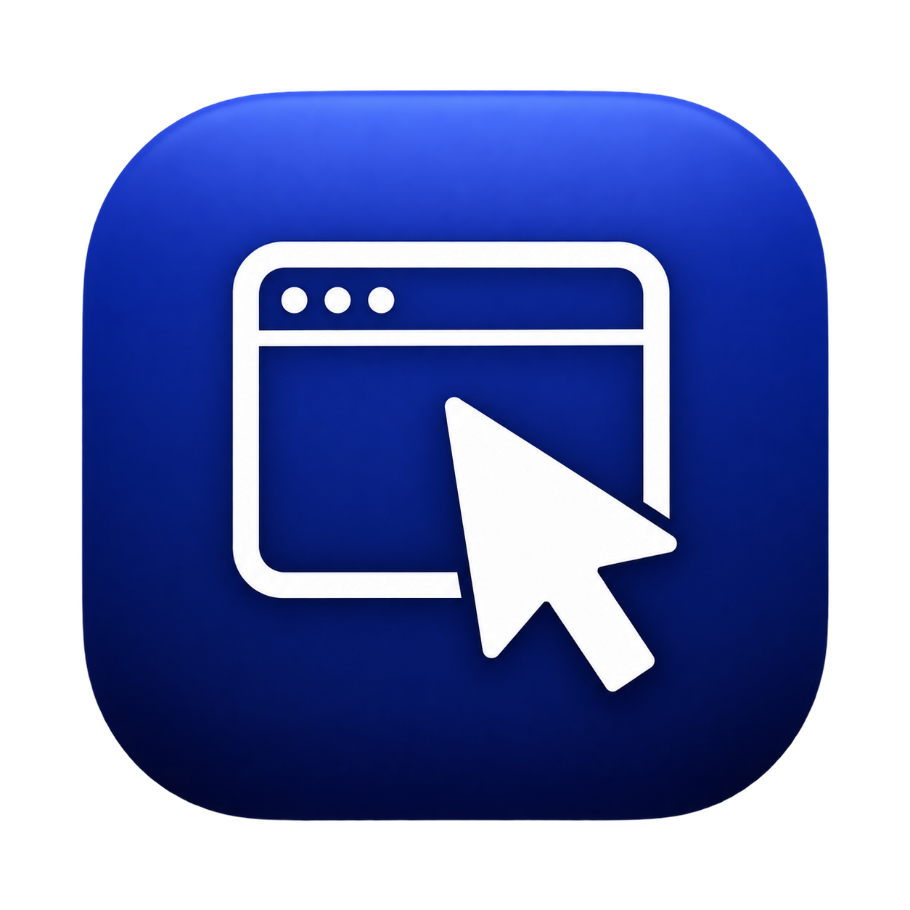

# apple-cua



Native macOS computer-use control, designed for the OpenAI computer-use action vocabulary. Host-native (CGEvent / ScreenCaptureKit-class) speed, no VM sandbox required.

[](LICENSE)
[](package.json)
[](#permissions)
[](#mcp-server)

**Contents** — [Why this exists](#why-this-exists) · [Quickstart](#quickstart) · [The four surfaces](#the-four-surfaces) · [MCP server](#mcp-server) · [Targeting by description](#targeting-elements-by-description) · [Observation cost](#observation-cost) · [Action surface](#action-surface) · [Permissions](#permissions) · [Architecture](#architecture) · [Repository layout](#repository-layout) · [Roadmap](#roadmap) · [Development](#development) · [Comparison](#comparison-vs-cua--codex) · [License](#license)

## Why this exists

OpenAI Codex Computer Use is fast because it runs on the host with macOS-native APIs (ScreenCaptureKit, CoreGraphics, local MCP stdio). By contrast, [trycua/cua](https://github.com/trycua/cua) is portable but slow because of the multi-hop VM/HTTP/PIL pipeline: Python agent loop, 500 ms post-action screenshot delay, HTTP/WebSocket JSON to a guest FastAPI server, PIL encode, base64 SSE, client decode/re-encode. Codex removes the VM boundary and repeated image serialization; cua keeps it for sandbox isolation.

`apple-cua` is the Codex-style local path with cua's clean platform abstraction, written in strict TypeScript. It gives you the same app-oriented `list_apps / get_app_state / click / type_text / press_keys / scroll / drag` vocabulary that models expect, but executes directly on your Mac through native macOS APIs: ScreenCaptureKit for window and main-display capture, `koffi`-bound CoreGraphics for global input, Accessibility for app state/actions, and SkyLight/AppKit FFI for app-targeted window sessions. No Docker, no QEMU, no VNC, no bundled helper service, no cloud API key.

The design trade-off is documented in [`codex-cua-comparison.md`](./codex-cua-comparison.md). If you need strong VM isolation, use cua. If you need low-latency host-native control, use this.

| | Codex | cua | apple-cua |
|---|---|---|---|
| Runs on | Host Mac | VM / container / cloud | Host Mac |
| Needs VM | No | Yes (default) | No |
| Needs API key | OpenAI only | Optional `CUA_API_KEY` for cloud | No |
| Screenshot path | Native ScreenCaptureKit / IOSurface | PIL `ImageGrab` in guest | Native ScreenCaptureKit, CoreGraphics for the main display, `screencapture -l` for uncapturable windows |
| Input path | Native CGEvent / Apple Events | `pynput` in guest | CoreGraphics CGEvent via koffi + SkyLight/AppKit FFI for app-targeted windows |
| Transport | Local MCP stdio | HTTP/WebSocket JSON + SSE | Local process / MCP stdio / pi extension |
| Post-action delay | None reported | 500 ms default | None |
| Isolation | macOS permissions + app scoping | VM / container sandbox | macOS permissions only |

## Quickstart

```bash
git clone https://github.com/bob01933/bob-cua.git
cd apple-cua
pnpm install
pnpm --filter @apple-cua/core build
pnpm --filter @apple-cua/cli build
./packages/cli/dist/cli.js --version
./packages/cli/dist/cli.js screenshot -o /tmp/shot.png
```

Expected output:

```text
0.1.0
Screenshot saved to /tmp/shot.png
```

If the PNG is 0 bytes or black, grant Screen Recording permission to your terminal in **System Settings → Privacy & Security → Screen Recording**. See [`skills/apple-cua/references/installation.md`](./skills/apple-cua/references/installation.md) for the full permission walkthrough.

## The four surfaces

### CLI

The `apple-cua` binary is a thin `commander.js` wrapper over `MacOSHostComputer`.

```bash
# Screenshot (main display)
apple-cua screenshot -o shot.png

# Region of a display, in global screen points
apple-cua screenshot -o shot.png -r 100,100,800,600

# A specific display id instead of the main display
apple-cua screenshot -o shot.png --display 58

# Click and type
apple-cua click -x 500 -y 300
apple-cua type "Hello, world"

# Key chord
apple-cua key cmd --modifiers cmd,shift

# Query state
apple-cua cursor
apple-cua screen
```

Sample output:

```text
Screenshot saved to shot.png
Clicked at 500,300
Typed: Hello, world
Pressed: command+shift+cmd
1200,800
2560x1600
```

### Per-PID targeting

For the low-level CLI, input events default to the globally focused application; guarded MCP instead requires an observed, approved target. For explicitly authorized CLI app targeting, call `get_app_state` for that app first or pass `--target-pid <pid>` after the app has a visible window. The host implementation caches the app window session and routes mouse, drag, keyboard, text, and scroll events through CoreGraphics plus SkyLight/AppKit FFI. If no visible target window is known, targeted input fails loudly instead of falling back to global cursor-moving input.

Example: send a URL to Safari while Terminal stays focused:

```bash
# 1. get Safari's PID
SAFARI_PID=$(pgrep -x Safari)

# 2. focus Safari's address bar, type the URL, and press Return
# each CLI call primes the visible target window before dispatch
apple-cua --target-pid "$SAFARI_PID" key l -m cmd
apple-cua --target-pid "$SAFARI_PID" type "https://example.com"
apple-cua --target-pid "$SAFARI_PID" key Return

# click/scroll/drag Safari content while Slack stays frontmost
apple-cua --target-pid "$SAFARI_PID" click -x 500 -y 300
apple-cua --target-pid "$SAFARI_PID" scroll --direction down --amount 5
apple-cua --target-pid "$SAFARI_PID" drag --from-x 100 --from-y 100 --to-x 300 --to-y 300
```

If `--target-pid` is used before a target window has been discovered, the command fails with a clear app-session error instead of falling back to the global path.

### Per-PID mouse/scroll/keyboard architecture

- **Global input** (no `--target-pid`) stays on the koffi CoreGraphics HID-tap path and remains backward compatible.
- **Targeted mouse/drag** resolves a visible app window, creates AppKit-backed `CGEvent`s when a window is known, stamps target-window fields plus SkyLight field 40, activates the window without raising it, and posts through SkyLight plus the window owner's process serial number.
- **Targeted keyboard** requires a remembered app window and uses SkyLight `SLSEventAuthenticationMessage` before `SLEventPostToPid`.
- **Targeted text** uses per-character Unicode CGEvent payloads routed through the remembered app session.
- **Targeted scroll** requires the same remembered app window and refuses to fall back to the global event tap.

### MCP server

Use the guarded stdio MCP server for autonomous desktop tasks. It works through ordinary
MCP schemas and text/image results, without a Pi-specific extension or embedded agent.
It must run on the Mac being controlled, with the macOS permissions of the process that runs
it — or of the signed helper app below, which carries its own TCC identity.

```bash
pnpm --filter @apple-cua/core --filter @apple-cua/mcp build
APPLE_CUA_ALLOWED_BUNDLE_IDS=com.apple.TextEdit node packages/mcp/dist/server.js
```

The host owner configures exact approved bundle IDs through
`APPLE_CUA_ALLOWED_BUNDLE_IDS`. **Missing or empty means no apps are approved**; the agent
cannot approve itself. App approval does not authorize every operation inside the app.

A Claude Desktop-style server configuration is below. Other clients use different root
keys; see the [OpenClaw and Hermes setup guide](skills/apple-cua/references/harnesses.md).
Merge configuration rather than replacing unrelated settings.

```json
{
  "mcpServers": {
    "apple-cua": {
      "command": "node",
      "args": ["/absolute/path/to/apple-cua/packages/mcp/dist/server.js"],
      "env": {
        "APPLE_CUA_ALLOWED_BUNDLE_IDS": "com.apple.TextEdit"
      }
    }
  }
}
```

For a grant that survives rebuilds, run the server through the signed helper app instead of
`node` directly: the bundle carries its own TCC identity (`dev.applecua.mcp`), so Screen
Recording and Accessibility attach to it rather than to whatever launched the server.

```bash
scripts/build-tcc-helper.sh
grok mcp add apple-cua -s user \
  -e APPLE_CUA_ALLOWED_BUNDLE_IDS=com.apple.TextEdit \
  -e APPLE_CUA_DELIVERY=background \
  -- /absolute/path/to/apple-cua/packages/mcp/dist/apple-cua-mcp.app/Contents/MacOS/apple-cua-mcp \
  /absolute/path/to/apple-cua/packages/mcp/dist/server.js
```

The first run prompts for Screen Recording and Accessibility for "apple-cua MCP"; grant both in
System Settings and restart the server. The helper bundles a self-contained `node` (Homebrew's build
links `libnode.dylib` and cannot be copied into a bundle), resolved in this order: `APPLE_CUA_NODE`,
then the first standalone node on `PATH`, then `~/.local/bin/node` and `/usr/local/bin/node` — and the
build fails loudly when none of them is self-contained. Ad-hoc signing gives each rebuild a new code
identity, so macOS asks for the two grants again after a rebuild; set `APPLE_CUA_SIGN_IDENTITY` to a
stable certificate to keep one identity across builds.

**Context-first contract (MCP migration):**

1. The harness understands the user's goal, target and intended result before choosing input.
2. `get_app_state` returns the target's current state and an opaque `observation_token`.
3. Every mutating tool, including `press_keys`, requires that token. The server consumes it,
   validates the observed target/current approval and serializes preflight, input and post-read.
4. Read the resulting state before using any continuation token. A mutation answers with a
   compact post-action observation (what changed plus a fresh one-use `observation_token`)
   and omits the full accessibility tree unless the call passes `full_state: true`, so long
   autonomous runs stop paying for a complete tree after every click.
5. Unchanged, unavailable, failed or unexpected context pauses input; explicitly observe
   again rather than replaying. `set_fields` exists for multi-field edits: it applies up to
   10 verified value updates in one call, reading each back from the app, and reports
   `requested`/`inputDispatched`/`verified` so dispatched input is never read as success.
6. Every mutation closes its own loop with a small envelope, so the caller never has to guess
   what happened: `route` (`accessibility` or `synthetic_events`) and `delivery`
   (`background`/`foreground`) say how the input actually travelled, `effect` says how far the
   driver can account for the result (`confirmed` from a value read back, `partial` when some
   updates verified, `observed_change` when the observed window changed after the action,
   `suspected_noop` when nothing changed, `unverifiable` when input went out with no evidence
   either way), and `evidence` lists what that judgment rests on (`value_readback`,
   `ax_change`, `window_change`). An `escalation` field points at the next honest step
   (`pixel`, `foreground`, `page`, `session`) with its reason instead of silently retrying.
   `windowEvents` names any window that appeared during the action, so a modal sheet or a
   newly opened window is never missed.
7. `verify_state` is the read-only way to check a result instead of assuming it. Given the
   latest token it re-reads the app freshly and answers per expectation: does the element
   still exist, does its `value`/`label` match, is a window with that title open. Each check
   returns `verified` plus the `actual` value found, and `timeout_ms` polls until every check
   passes or the deadline passes. A false answer means the expectation does not hold yet, not
   that the action failed silently.
8. Input is aimed at one exact window. An observation reports the window it scoped to
   (`windowId`, `windowTitle`) and, when the app has several windows, every alternative
   (`windowCandidates`), because the driver resolves the app's *focused* window rather than
   whatever window order happens to return. A mutation is then checked against that same
   window id; if it is gone the driver refuses instead of silently retargeting another window
   of the same app. Pass `window_id` on `get_app_state` to observe a specific candidate.
9. A refusal is a result, not a crash: `actionDispatched: false`, `effect: "refused"`, a
   machine-readable `reason` (`stale-observation-token`, `element-not-observed`, `app-not-approved`,
   `app-not-frontmost`, `window-missing`, `window-changed`, `window-bounds-changed`, `url-blocked`,
   `url-unavailable`) and an `escalation` naming the next honest step (`no_window_target`,
   `stale_observation`, `permission_required`, `delivery_failed`, `route_unavailable`). Nothing is
   dispatched on a refusal, and the answer is flagged `isError` so a caller that only checks that
   flag never mistakes a refusal for success.
10. Confirm irreversible/external actions with the human through the harness. Tokens are
   sequencing evidence, not proof of consent or model understanding. UI text is untrusted data.

Use element `id` values from the observation, not array positions or guessed coordinates.
The server refuses a missing target window instead of substituting the full desktop. Its queue
covers only that server instance, not other agents, raw CLI callers or human input.

Load the [portable agent skill](skills/apple-cua/SKILL.md) alongside the MCP tools. Raw CLI/core
and the Pi extension remain low-level interfaces; the MCP guard does not automatically apply
to them. This migration intentionally rejects old unobserved mutation calls.

#### Targeting elements by description

A caller that knows *what* it wants but not where it is does not have to buy the whole tree. Three
tools take a description and do the resolving server-side:

| Tool | What it does |
|---|---|
| `find_elements` | Resolves a query — `role`, `label`, `label_contains`, `value_contains`, `text`, all fields AND-ed, role matching case- and `AX`-prefix-insensitive — against the live tree and answers ranked matches with their `element_index`, geometry, `matched_by` evidence and the one-use `observation_token` for those ids. `found: false` names `nearMisses` (candidates sharing words with the query, or a role's own controls in reading order) instead of failing blind. No screenshot unless `include_screenshot: true`. |
| `click_target` | One call does observe → resolve → wait up to `timeout_ms` for the element to appear → optional `hover_first` → dispatch → verify: it presses through the element's own `AXPress` action when the control advertises one, and clicks the element centre otherwise (`press: "pointer"`, a non-left `mouse_button`, or a `click_count` that needs the pointer). The answer names the target it resolved, the `alternatives` it did not click, the `route`/`delivery` that carried the input, and the `expect` verification. `found: false` dispatches nothing. |
| `open_app` | Brings a running app forward or launches it and waits until it is observable, answering `launched`/`activated` with the pid and bundle id. Opening an app authorizes no observation and no input. |

Measured on this machine against the loop an agent otherwise runs (`get_app_state` → pick an id →
`click` → `verify_state`), same TextEdit text area, five runs each, medians, server through the
signed helper: **283 ms and 1,839 bytes for one `click_target`** against **694 ms and 47,750 bytes for
the three-call loop**, both verified 5/5 and resolving the same element every run. The full transcript
and the AXPress-route proof live in [`.sisyphus/evidence/`](./.sisyphus/evidence).

### pi-extension

Install into a [pi coding agent](https://github.com/badlogic/pi-mono/tree/main/packages/coding-agent) session:

```bash
pi install file://./packages/pi-extension
```

Loading the extension auto-enables native computer-use for Anthropic Messages and OpenAI Responses models. Anthropic requests receive the `computer-use-2025-01-24` native `computer` tool plus the required beta header/body fields and a short system prompt. OpenAI Responses requests receive only `{ "type": "computer" }` in `payload.tools` — no headers, no `extra_body`, and no extra system prompt. No configuration is required; advanced users can opt out of both providers with `APPLE_CUA_DISABLE_COMPUTER_USE_BETA=1` (`true`, `yes`, and `on` also work).

The extension resolves the host display in logical macOS points, captures model-facing screenshots at a 2560px long edge (2560x1440 on large 16:9 displays), declares those dimensions to Anthropic, and unscales returned model coordinates back to logical points before dispatching clicks, moves, and drags. OpenAI Responses uses the same screenshot invariant: model coordinates are always in the image space the model received, while `MacOSHostComputer` still receives logical points.

The extension also registers Codex-compatible Computer Use tools:

| Tool | Purpose |
|---|---|
| `list_apps` | List running apps |
| `get_app_state` | Capture screenshot + accessibility tree for an app |
| `click` | Click by element index or screenshot coordinate |
| `perform_secondary_action` | Invoke an accessibility action by element index |
| `set_value` | Set a settable accessibility element value |
| `drag` | Drag between screenshot coordinates |
| `scroll` | Scroll an app by pages |
| `type_text` | Type literal text |
| `press_keys` | Press keys or key chords, with optional hold and interval timing |

The extension default-exports a pi extension factory and keeps these tools available even when native computer-use auto-activation is disabled.

### Programmatic API

Import `MacOSHostComputer` from `@apple-cua/core` and drive macOS directly:

```typescript
import { MacOSHostComputer } from "@apple-cua/core";

const computer = new MacOSHostComputer();

const { data, width, height } = await computer.screenshot();
await computer.click({ x: 500, y: 300 });
await computer.type("Hello from TypeScript");
await computer.key("Return", { modifiers: ["command"] });
await computer.scroll({ direction: "down", amount: 10 });
await computer.drag({ from: { x: 100, y: 200 }, to: { x: 300, y: 400 } });

const pos = await computer.getCursorPosition();
const size = await computer.getScreenSize();

await computer.close();
```

All methods return Promises. The API is intentionally identical to the OpenAI `Computer` abstraction so you can drop it into an agent loop without translation.

## The phone: a real iPhone through iPhone Mirroring

apple-cua also drives a real iPhone, through the macOS iPhone Mirroring window. No jailbreak, no
Xcode, nothing installed on the phone.

- **Eyes**: Apple's Vision framework reads the window capture, so every visible string comes back
  with a tap-ready centre in global screen points. The phone image is a video stream, which is
  exactly why accessibility cannot see into it and OCR has to.
- **Hands**: synthesized mouse and keyboard events delivered to the mirroring window's own
  process, so the phone is driven **without bringing its window forward and without touching the
  pointer**. A scroll borrows the pointer for the length of its gesture and puts it straight back.
- **Session gating**: every action re-checks the session and refuses unless it is `ready`.
  `blocked` (Unlock iPhone, iPhone in Use, connection paused or ended, Mac login), `no-window`
  and `not-running` all come back with what the user has to do about it. Nothing taps through an
  interstitial, and nothing types a password for you.

\u0060\u0060\u0060bash
apple-cua ios status          # ready | blocked | no-window | not-running
apple-cua ios observe         # every visible string with a tap-ready centre
apple-cua ios tap-text "Settings"
apple-cua ios type "hello"    # exact: the paste path, past iOS autocorrect
apple-cua ios scroll down --amount 0.4
apple-cua ios home
\u0060\u0060\u0060

Two rules worth knowing before writing a loop:

- `scroll(direction)` says what you want to **see** ("scroll down" reveals content further down
  the list); `swipe(direction)` says which way the **finger** moves. macOS 26 drops vertical
  touch-drags, so lists move with `scroll`, and `swipe` is for page turns and carousels.
- One action, then one cheap check: `ios observe` returns every label with coordinates, and a
  bounded re-observe beats a fixed sleep.

Setup: pair iPhone Mirroring once by hand, grant the terminal **Accessibility** and **Screen
Recording** (Screen Recording takes effect after the terminal restarts), and keep the phone
unlocked while work runs. The MCP side exposes the same capability as token-guarded `ios_*`
tools. Details:
[`skills/apple-cua/references/ios-automation.md`](./skills/apple-cua/references/ios-automation.md).

## Observation cost

Observation is the loop's dominant cost, so the driver keeps the cheap paths cheap. Measured
on an M-series Mac against a Finder window with about 800 accessibility elements, warm runs,
reporting medians:

| Step | Before | Now |
|---|---|---|
| `get_app_state` with screenshot | 4,815 ms | about 1,350 ms |
| Accessibility walk, window-scoped | 3,552 ms | 840 ms |
| Accessibility walk capped at 250 elements | - | 92 ms |
| Running-app lookup | 1,162 ms (`osascript`) | under 1 ms (in-process NSWorkspace) |
| Window screenshot | 198 ms (`screencapture -l`) | 28 ms (native ScreenCaptureKit) |

The walk now runs in one round trip per element (attributes are read together), reads the
parent window instead of the whole app when the target window is known, skips action reads
for non-actionable roles, and enumerates running apps in-process rather than by spawning
AppleScript. Waiting for a settled UI is event-driven: an `AXObserver` on the app element
replaces repeated 250-element poll walks, which cut a Finder observation from a 812 ms
median to 537 ms over five warm runs on the same window. Capture honours the requested
format on every path: JPEG is 4.6x smaller than PNG for a full 1920x1080 display (293 KB
against 1,363 KB) and 5.2x smaller for a 600x400 region (118 KB against 612 KB) at quality
72. Main-display capture falls back to CoreGraphics when the ScreenCaptureKit path is
unavailable; window capture falls back to `screencapture -l` plus `sips` when the native
library or the window itself is not capturable. Driver-level numbers, the conditions they were
measured under, and the dimensions this driver does *not* measure are recorded in
[`driver-scorecard.md`](./docs/driver-scorecard.md).

## Working while the agent works

Pass `--background` (CLI) or set `APPLE_CUA_DELIVERY=background` (MCP server) to keep a run out
of your way: input goes to the target app's own window, so the frontmost app does not change and
the cursor does not move. Background delivery also drops the frontmost requirement on input: the
driver clicks, types and scrolls a window you are not looking at, while the target app must still
be approved and its window identity and bounds must still match the observation. Anything that
would need the foreground — a global click with no target app, or a route that has to lease focus —
is refused with the action named instead of quietly taking over the machine. Attended delivery is
still the default and still requires the frontmost app, because a few apps only accept pointer
input while they are frontmost. Verified on a live session against Cua Driver 0.28.2: a background
click landed with the frontmost app and the real cursor untouched, and the action answer cost
1.4 KB instead of 121 KB because the post-action image is now opt-in (`include_screenshot: true`).

Observation is aimed at the app's focused window, resolved natively, so a multi-window app is
not scoped by whatever order window enumeration returns; the chosen window id, its title and
any alternatives travel back on the state, and input is validated against that same id.

The knobs that keep this tunable, all per call: `include_screenshot: false` skips the image
and returns only element ids and geometry, which is the cheapest way to re-index before an
element action; `include_accessibility_tree: false` is the mirror image — skip the accessibility
walk and its settle wait and get the window image with no elements and no observation token, the
cheapest way to look at pixels; `settle_ms` caps the pre-capture UI settle wait (0 skips it);
`max_elements` caps a very large tree, `subtree_of` re-observes just one branch with element ids
restarting at 0, and `include_menu_bar` adds application menus when they are part of the task.
When a tree is capped the answer says so in `elementsTruncated`, and a walk at a different budget
is treated as a fresh baseline rather than diffed against a differently truncated one, so a diff
never reports elements that were merely outside the budget as removed. `list_windows` names every
on-screen top-level window with its id, pid, app, title and bounds so an agent can pick its target
before observing instead of guessing. Drilling in with `subtree_of` costs what the branch costs:
on a Finder window whose full tree is 718 elements, re-observing a row returned 10 elements in
165 ms instead of roughly 810 ms for the window.

## Action surface

Every tool/action exposed by CLI, MCP, and pi-extension:

| Action | Parameters | Returns | What it does |
|---|---|---|---|
| `screenshot` | `targetSize?: { width, height }`, `region?: { x, y, width, height }`, `display?: number`, `format?: "png" \| "jpeg"`, `quality?: number` | `Buffer` + dimensions + mime type | Native ScreenCaptureKit display capture, cropped in CoreGraphics when `region` is given and resized to `targetSize`. Regions, display selection and the main display all honour `format` |
| `click` | `x: number`, `y: number` | void | Single click via CoreGraphics `CGEventCreateMouseEvent` / `CGEventPost` |
| `double_click` | `x: number`, `y: number` | void | Double click via CoreGraphics `CGEventCreateMouseEvent` / `CGEventPost` |
| `type` | `text: string` | void | Type literal text via CoreGraphics `CGEventCreateKeyboardEvent` |
| `key` | `key: string`, `modifiers?: string[]` | void | Key press with optional cmd/alt/ctrl/shift modifiers via CoreGraphics |
| `scroll` | `direction: "up" \| "down" \| "left" \| "right"`, `amount: number` | void | Scroll wheel event via CoreGraphics `CGEventCreateScrollWheelEvent` |
| `drag` | `fromX, fromY, toX, toY` | void | Mouse down, move, up via CoreGraphics `CGEventCreateMouseEvent` |
| `cursor_position` | none | `{ x, y }` | Current mouse coordinates via `CGEventGetLocation` |
| `screen_size` | none | `{ width, height }` | Logical desktop bounds via Finder, with `system_profiler` fallback |

## Permissions

macOS gates screen capture, input synthesis, and app lookup behind separate permission dialogs. The first time you run `screenshot` or `click`, macOS may prompt automatically. If it does not, grant them manually:

1. **System Settings → Privacy & Security → Screen Recording** — toggle your terminal/IDE ON.
2. **System Settings → Privacy & Security → Accessibility** — toggle the same terminal/IDE ON.
3. **System Settings → Privacy & Security → Apple Events** — allow the terminal/IDE if you use `--target-bundle-id` or permission helpers that query System Events.
4. Restart the terminal (some apps cache the permission state at launch).

Permission is per-binary. If you switch from iTerm2 to Ghostty, you must re-grant for the new app.

Full walkthrough: [`skills/apple-cua/references/installation.md`](./skills/apple-cua/references/installation.md).

## Architecture

```text
+----------------------------------------------------------+
|  Agent / CLI / MCP client / pi session                   |
|  +----------------------------------------------------+  |
|  |  @apple-cua/core                                   |  |
|  |   ComputerInterface (abstract)                     |  |
|  |   +-- HostComputer  (macOS implemented)            |  |
|  |   +-- VMComputer    (stub: QEMU/Lume/VirtualBox)     |  |
|  |   +-- CloudComputer (stub: cloud provider)         |  |
|  +----------------------------------------------------+  |
|                    |                                     |
|  +-----------------+------------------+                 |
|  |                 |                  |                  |
|  v                 v                  v                  |
|  CLI            MCP server       pi-extension            |
|  commander.js   @modelcontext    registerTool factory    |
|                 protocol/sdk       default export          |
|  +----------------+------------------+                 |
|                    |                                     |
|  v                 v                  v                  |
|  SCK (capture)    koffi/CGEvent    SkyLight/AppKit FFI   |
|  (screenshots)    (global input)   (targeted sessions)   |
+----------------------------------------------------------+
```

| Package | Path | Role |
|---|---|---|
| `@apple-cua/core` | [`packages/core`](./packages/core) | `ComputerInterface` + platform abstractions (`HostComputer`, `VMComputer`, `CloudComputer`) + `MacOSHostComputer` implementation |
| `@apple-cua/cli` | [`packages/cli`](./packages/cli) | `commander.js` binary (`apple-cua`) |
| `@apple-cua/mcp` | [`packages/mcp`](./packages/mcp) | MCP stdio server (`apple-cua-mcp`) exposing Codex Computer Use tools |
| `@apple-cua/pi-extension` | [`packages/pi-extension`](./packages/pi-extension) | Pi coding-agent extension with Codex-compatible Computer Use tools |
| `skills/apple-cua` | [`skills/apple-cua`](./skills/apple-cua) | OpenCode-style skill definition + installation reference |

## Repository layout

| Path | What lives there |
|---|---|
| [`packages/core`](./packages/core) | Platform-abstracted interfaces, the native macOS computer, the guarded token layer, and targeting (`matchElements`, `openApplication`) |
| [`packages/mcp`](./packages/mcp) | The stdio MCP server (33 tools) and `assets/appicon.png` for the signed helper bundle |
| [`packages/cli`](./packages/cli) | The `apple-cua` command line |
| [`packages/pi-extension`](./packages/pi-extension) | Pi coding-agent tools, including native Anthropic/OpenAI computer-use shapes |
| [`skills/apple-cua`](./skills/apple-cua) | The portable agent skill: workflow, usage, permissions, harness setup |
| [`docs`](./docs) | Research and head-to-head write-ups ([driver shootout](./docs/driver-shootout-cua.md), [scorecard](./docs/driver-scorecard.md), [OMO/Grok integration](./docs/omo-cua-hand.md)) |
| [`scripts`](./scripts) | The signed helper build, the evidence harnesses (`measure-cua-shootout`, `measure-strategic-targeting`), and fixture generators |
| `.sisyphus/evidence` | Raw transcripts and measurement artifacts the docs cite |

## Roadmap

| Feature | Status | Notes |
|---|---|---|
| macOS host-native screenshot | Implemented | Native ScreenCaptureKit window and main-display capture, resized to the requested size |
| macOS host-native input | Implemented | Native CoreGraphics CGEvent via koffi for global input; SkyLight/AppKit FFI for targeted app windows |
| QEMU runtime | Interface stub | [`packages/core/src/platform/vm.ts`](./packages/core/src/platform/vm.ts) |
| Lume runtime | Interface stub | Apple Virtualization.Framework VM |
| VirtualBox / Parallels runtime | Interface stub | Planned |
| Cloud provider runtime | Interface stub | [`packages/core/src/platform/cloud.ts`](./packages/core/src/platform/cloud.ts) |
| ScreenCaptureKit capture | Implemented | Window and main-display capture through `libsckit.dylib`, with CoreGraphics and `screencapture -l` fallbacks |
| SkyLight authenticated targeted input | Implemented | TypeScript FFI uses `SLEventPostToPid`, focus-without-raise, AppKit-backed mouse events, and keyboard auth messages |
| Accessibility API queries | Implemented | `AXUIElement` tree extraction, `set_value`, and secondary actions |

## Development

```bash
# Install dependencies
pnpm install

# Type check + lint + test
pnpm check

# Test only
pnpm test

# Build all packages
pnpm build

# Build the signed helper bundle (macOS app icon + TCC identity)
./scripts/build-tcc-helper.sh
```

Per-package builds:

```bash
pnpm --filter @apple-cua/core build
pnpm --filter @apple-cua/cli build
pnpm --filter @apple-cua/mcp build
pnpm --filter @apple-cua/pi-extension build
```

Standards: ultra-strict TypeScript, ESM with `.js` imports, Biome formatting, Vitest, tabs, line width 120. See [`AGENTS.md`](./AGENTS.md) for the full convention.

CI runs the same `pnpm check` on `macos-latest` (lint, package and test typechecks, then the full
Vitest suite) — see [`.github/workflows/ci.yml`](./.github/workflows/ci.yml).

## Comparison vs cua / codex

| Dimension | cua | codex | apple-cua |
|---|---|---|---|
| Language | Python | Rust + proprietary plugin | TypeScript |
| Sandbox | VM / container / cloud | Host macOS (permission-scoped) | Host macOS (permission-scoped) |
| Screenshot latency | VM path ~500 ms + encode + transport; host-native Cua Driver measures 436 ms p50 full window observation, 175 ms capture-only | Native frame interval + local IPC | 417 ms p50 full Finder observation over MCP (413 ms TextEdit), 386 ms AX-only, 297 ms capture-only (n=15, measured 2026-09-17) |
| Input latency | VM path HTTP → guest → pynput; host-native Cua Driver measures 1.4 s p50 per MCP action | Native CGEvent / Apple Events | Event posting stays native CoreGraphics via koffi; the full MCP action measures 1.8 s p50 for a click, 1.5 s to type 45 characters and 1.5 s for one key press, including preflight, delivery and the fresh observation it returns (n=10, measured 2026-09-17), and a verified step answers in 1.4 KB instead of 121 KB. A described-element `click_target` answers in 283 ms and 1.8 KB end to end. |
| Portability | Linux, macOS, Windows, Android, cloud | macOS only | macOS only (stubs for VM/cloud) |
| Open source | Full SDK | Plugin host OSS, Computer Use plugin proprietary | Fully open source |
| Agent integration | Any Python agent | Codex desktop only | CLI, MCP, pi-extension, or any TS agent |

Full analysis: [`codex-cua-comparison.md`](./codex-cua-comparison.md).
Measured head-to-head against Cua Driver 0.28.2 (latency, payloads, background delivery):
[`docs/driver-shootout-cua.md`](./docs/driver-shootout-cua.md).

## License

MIT — see [LICENSE](LICENSE).

## Related

- [trycua/cua](https://github.com/trycua/cua) — upstream portable computer-use SDK (Python, VM-based)
- [OpenAI Codex](https://github.com/openai/codex) — Codex desktop app with proprietary Computer Use plugin
- [pi-mono](https://github.com/badlogic/pi-mono) — the pi coding-agent runtime
- [pi-cua-integration](https://github.com/code-yeongyu/pi-cua-integration) — pi extension that wraps cua sandboxes (the model for this README)
